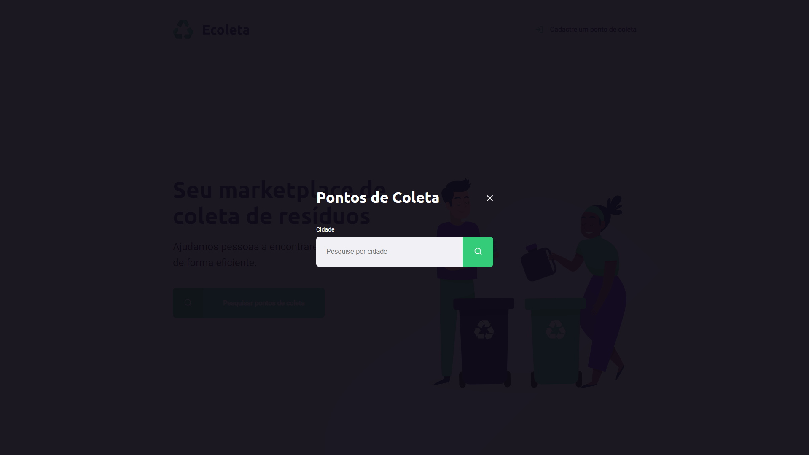

## Projeto desenvolvido na Next Level Week promovida pela Rocketseat.
A Next Level Week (NLW) é um projeto de desenvolvimento prático e intensivo com o 
objetivo de ajudar desenvolvedores que almejam levar sua carreira ao próximo nível.

_Página principal_

_Página de registro de um novo ponto de coleta_

_Modal para pesquisar pontos de coleta em cidades_

_Página com os resultados do filtro_

## Sobre o projeto:
* O projeto foi desenvolvido utilizando JavaScript, HTML e CSS;

* As imagens e demais recursos foram disponibilizadas pela RocketSeat;

## Minha visão do evento:
> O evento foi uma grande oportunidade de renovar e aumentar meus conhecimentos de HTML e CSS, bem como introduzir tecnologias
recorrentes na linguagem JavaScript (a qual almejo masterizar) e também me motivou ainda mais à buscar meus objetivos como
desenvolvedor. A Rocketseat é uma plataforma maravilhosa com uma metodologia única e extremamente funcional, fazendo com que
as aulas - apesar de longas - fossem extremamente cativantes e a todo momento focadas em relembrar conceitos básicos, mas também
ensinar coisas novas.
 

> Diferentemente da Semana Omnistack (evento anterior à NLW, também promovido pela Rocketseat), a Next Level Week foi capaz de
introduzir o desenvolvimento até para pessoas que recém fizeram seu primeiro `Hello World`, o que foi capaz de arrecadar ainda
mais pessoas para o mundo da programação! Deixo aqui meu agradecimento à toda Rocketseat, especialmente ao mentor
das aulas que acompanhei, Mayk Brito, e espero ter outras oportunidades para participar de aulas promovidas por essa equipe!
Então, bora codar!

<h2> Como utilizar:</h2>
* Primeiro abra um Terminal na pasta do projeto;

* Dentro do terminal digite `npm install` e `npm install sqlite3`, para instalar as dependências do projeto;

* Digite `npm start` para iniciar um servidor Node (porta 3000).

* Abra seu navegador e na barra de busca lá em cima digite "localhost:3000".

